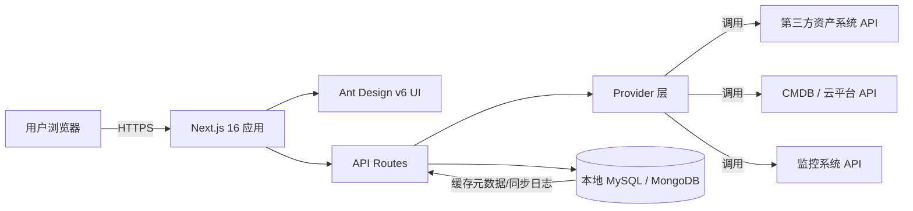
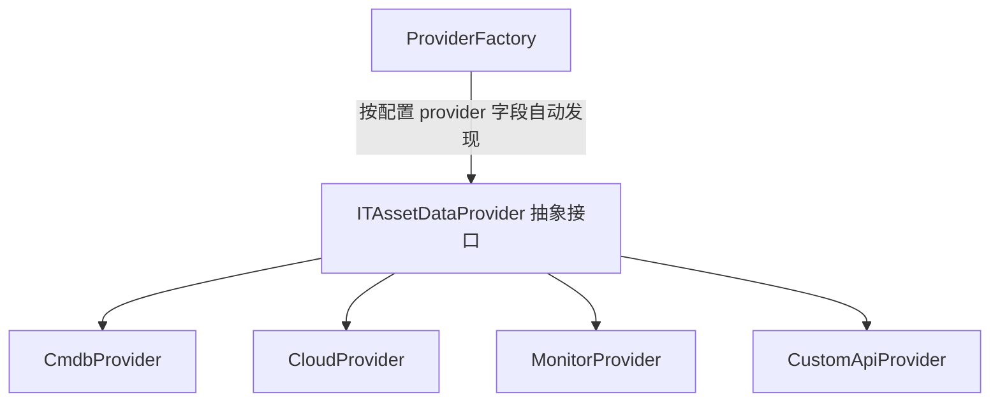

# IT资产中心概念设计文档

## 1. 项目背景与目标

### 1.1 背景
IT资产中心面向高校/企业信息化管理部门，用于统一梳理、查看和查询所有 IT 资产。所有数据由第三方系统通过 API 提供，本应用不对资产数据进行创建、修改、删除操作。

### 1.2 目标
- 以**信息系统**为主线，建立全校/全企业的 IT 资产视图。
- 支持多类型资产的关联展示、检索和下钻。
- 通过只读方式对外暴露资产数据，保证源系统数据权威性。
- 后续可扩展 AI 问答能力，支持自然语言查询资产分布。

## 2. 核心概念

| 概念 | 说明 |
|------|------|
| 信息系统（Information System） | 应用的核心组织单元，代表一个完整的业务系统或服务，例如：教务系统、财务系统、OA 系统。 |
| IT 资产（IT Asset） | 支撑信息系统运行的各种资源实体，必须归属到一个信息系统，也可跨系统共享。 |
| 资产类型（Asset Type） | 对 IT 资产的分类，包括基础设施、网络、数据、应用、软件、运维支撑、外部依赖等。 |
| 关系（Relationship） | 资产与资产之间的依赖关系，例如：域名 → IP、微服务 → 数据库。 |
| Provider | 第三方数据源实现，负责从指定系统拉取资产数据并转换为应用内部标准模型。 |

## 3. 资产分类体系

所有资产类型以信息系统为归属对象，按技术层次划分为 7 大类：

```mermaid
graph TD
    A[信息系统 Information System] --> B[基础设施层]
    A --> C[网络层]
    A --> D[数据层]
    A --> E[应用层]
    A --> F[软件层]
    A --> G[运维支撑层]
    A --> H[外部依赖层]

    B --> B1[物理设备]
    B --> B2[虚拟机]
    B --> B3[容器 / Pod]
    B --> B4[集群]
    B --> B5[网络设备]

    C --> C1[IP 地址]
    C --> C2[域名]
    C --> C3[DNS 记录]
    C --> C4[SSL 证书]
    C --> C5[安全组 / 防火墙规则]

    D --> D1[数据库]
    D --> D2[缓存 Redis]
    D --> D3[消息队列 MQ]
    D --> D4[存储系统]
    D --> D5[备份系统]

    E --> E1[Web 服务器]
    E --> E2[中间件 / 应用服务器]
    E --> E3[API 网关]
    E --> E4[负载均衡]
    E --> E5[微服务]

    F --> F1[操作系统]
    F --> F2[运行时 / 语言环境]
    F --> F3[基础软件包]

    G --> G1[监控系统]
    G --> G2[日志系统]
    G --> G3[CI/CD 流水线]
    G --> G4[代码仓库]

    H --> H1[第三方服务 / SaaS]
    H --> H2[外部接口依赖]
```



### 3.1 基础设施层

| 资产类型 | 说明 | 关键字段示例 |
|----------|------|--------------|
| 物理设备 | 服务器、小型机、机架等硬件设备 | 设备编号、品牌、型号、SN、所在机房、机柜、状态 |
| 虚拟机 | 运行在虚拟化平台上的 VM | 虚拟机名称、CPU、内存、磁盘、宿主机、IP |
| 容器 / Pod | Kubernetes 容器组或 Docker 容器 | 名称、命名空间、镜像、副本数、所属集群 |
| 集群 | K8s 集群、数据库集群、中间件集群 | 集群名称、类型、节点数、版本 |
| 网络设备 | 交换机、路由器、防火墙、VPN 等 | 设备名称、类型、管理 IP、品牌、位置 |

### 3.2 网络层

| 资产类型 | 说明 | 关键字段示例 |
|----------|------|--------------|
| IP 地址 | IPv4 / IPv6 地址 | IP、类型（公网/内网）、所属网段、分配状态 |
| 域名 | 互联网或内部域名 | 域名、备案信息、到期时间、DNS 服务器 |
| DNS 记录 | 域名解析记录 | 记录类型、主机记录、记录值、TTL |
| SSL 证书 | HTTPS 证书 | 域名、颁发机构、生效时间、过期时间 |
| 安全组 / 防火墙规则 | 访问控制策略 | 名称、方向、协议、端口、源/目标 |

### 3.3 数据层

| 资产类型 | 说明 | 关键字段示例 |
|----------|------|--------------|
| 数据库 | MySQL、PostgreSQL、Oracle 等 | 实例名、类型、版本、IP:Port、所属系统、字符集 |
| 缓存 Redis | Redis 实例或集群 | 实例名、版本、节点数、容量、部署模式 |
| 消息队列 MQ | RabbitMQ、Kafka、RocketMQ 等 | 名称、类型、版本、Topic/Queue 列表 |
| 存储系统 | 对象存储、NAS、SAN 等 | 名称、类型、容量、协议、挂载点 |
| 备份系统 | 数据备份任务或备份目标 | 备份对象、策略、保留周期、最近备份时间 |

### 3.4 应用层

| 资产类型 | 说明 | 关键字段示例 |
|----------|------|--------------|
| Web 服务器 | Nginx、Apache、IIS 等 | 名称、类型、版本、监听端口、配置文件 |
| 中间件 / 应用服务器 | Tomcat、WebLogic、Spring Boot 等 | 名称、类型、版本、端口、部署实例 |
| API 网关 | Kong、Zuul、Spring Cloud Gateway 等 | 名称、类型、路由数量、后端服务 |
| 负载均衡 | F5、Nginx、HAProxy、SLB 等 | 名称、类型、VIP、后端节点 |
| 微服务 | 独立部署的服务单元 | 服务名、版本、负责人、依赖服务、接口数 |

### 3.5 软件层

| 资产类型 | 说明 | 关键字段示例 |
|----------|------|--------------|
| 操作系统 | Windows Server、Linux 发行版等 | 名称、版本、架构、补丁级别 |
| 运行时 / 语言环境 | JDK、Node.js、Python、.NET 等 | 名称、版本、安装路径 |
| 基础软件包 | 数据库驱动、安全组件、Agent 等 | 名称、版本、用途 |

### 3.6 运维支撑层

| 资产类型 | 说明 | 关键字段示例 |
|----------|------|--------------|
| 监控系统 | Prometheus、Zabbix、Grafana 等 | 名称、类型、监控范围、告警规则数 |
| 日志系统 | ELK、Loki、Fluentd 等 | 名称、类型、采集范围、保留周期 |
| CI/CD 流水线 | Jenkins、GitLab CI、GitHub Actions 等 | 名称、类型、关联仓库、触发方式 |
| 代码仓库 | GitLab、GitHub、Gitee 等仓库 | 仓库名、地址、技术栈、负责人 |

### 3.7 外部依赖层

| 资产类型 | 说明 | 关键字段示例 |
|----------|------|--------------|
| 第三方服务 / SaaS | 云厂商服务、外部订阅服务 | 服务名、提供商、接口地址、到期时间 |
| 外部接口依赖 | 系统间接口调用关系 | 接口名、提供方、调用方、协议、状态 |

## 4. 数据模型设计

### 4.1 核心实体关系

```mermaid
erDiagram
    INFORMATION_SYSTEM ||--o{ DOMAIN : owns
    INFORMATION_SYSTEM ||--o{ IP_ADDRESS : owns
    INFORMATION_SYSTEM ||--o{ VIRTUAL_MACHINE : owns
    INFORMATION_SYSTEM ||--o{ PHYSICAL_DEVICE : owns
    INFORMATION_SYSTEM ||--o{ DATABASE : owns
    INFORMATION_SYSTEM ||--o{ WEB_SERVER : owns
    INFORMATION_SYSTEM ||--o{ REDIS : owns
    INFORMATION_SYSTEM ||--o{ MESSAGE_QUEUE : owns
    INFORMATION_SYSTEM ||--o{ MIDDLEWARE : owns
    INFORMATION_SYSTEM ||--o{ LOAD_BALANCER : owns
    INFORMATION_SYSTEM ||--o{ STORAGE : owns
    INFORMATION_SYSTEM ||--o{ NETWORK_DEVICE : owns
    INFORMATION_SYSTEM ||--o{ CONTAINER : owns
    INFORMATION_SYSTEM ||--o{ CLUSTER : owns
    INFORMATION_SYSTEM ||--o{ MICROSERVICE : owns
    INFORMATION_SYSTEM ||--o{ SSL_CERTIFICATE : owns
    INFORMATION_SYSTEM ||--o{ DNS_RECORD : owns
    INFORMATION_SYSTEM ||--o{ SECURITY_GROUP : owns
    INFORMATION_SYSTEM ||--o{ BACKUP : owns
    INFORMATION_SYSTEM ||--o{ MONITORING : owns
    INFORMATION_SYSTEM ||--o{ LOGGING : owns
    INFORMATION_SYSTEM ||--o{ CODE_REPOSITORY : owns
    INFORMATION_SYSTEM ||--o{ PIPELINE : owns
    INFORMATION_SYSTEM ||--o{ API_GATEWAY : owns
    INFORMATION_SYSTEM ||--o{ THIRD_PARTY_SERVICE : owns

    VIRTUAL_MACHINE ||--|| PHYSICAL_DEVICE : runs_on
    CONTAINER ||--|| CLUSTER : belongs_to
    MICROSERVICE ||--o{ DATABASE : depends_on
    MICROSERVICE ||--o{ REDIS : depends_on
    MICROSERVICE ||--o{ MESSAGE_QUEUE : depends_on
    DOMAIN ||--o{ DNS_RECORD : resolves_to
    DOMAIN ||--|| IP_ADDRESS : points_to
    WEB_SERVER ||--o{ DOMAIN : serves
    LOAD_BALANCER ||--o{ VIRTUAL_MACHINE : backend
```



### 4.2 关键实体定义

#### 信息系统（itam_information_system）

```typescript
interface InformationSystem {
  id: string;              // 系统唯一标识
  code: string;            // 系统编码
  name: string;            // 系统名称
  description?: string;    // 系统描述
  owner?: string;          // 负责人/部门
  status: 'running' | 'stopped' | 'deprecated' | 'planning';
  level?: 'core' | 'important' | 'general';  // 系统等级
  created_at: string;
  updated_at: string;
}
```

#### 通用资产基类（抽象）

```typescript
interface ITAssetBase {
  id: string;              // 资产唯一标识
  system_id: string;       // 所属信息系统 ID
  asset_type: AssetType;   // 资产类型
  name: string;            // 资产名称
  code?: string;           // 资产编码
  status: 'active' | 'inactive' | 'unknown';
  tags?: string[];         // 标签
  metadata?: Record<string, unknown>;  // 扩展字段
  created_at: string;
  updated_at: string;
}
```

### 4.3 数据表前缀

本项目名称为 **IT资产中心**，数据表统一使用前缀 `itam_`。

| 表名 | 说明 |
|------|------|
| itam_information_system | 信息系统主表 |
| itam_asset_relationship | 资产关系表 |
| itam_sync_log | 第三方数据同步日志 |

> 各类资产明细数据由第三方 API 提供，原则上不持久化到本地数据库；本地仅保存元数据、同步日志和缓存必要的关系数据。如确需本地缓存，可扩展 `itam_{asset_type}` 表。

## 5. 应用架构

### 5.1 总体架构



### 5.2 Provider 模式

沿用项目已有 Provider 抽象接口 + 具体实现的工程惯例：



- 文件名规范：`{provider-name}-provider.ts`
- 类名规范：`{ProviderName}DataProvider`
- 配置文件中通过 `provider` 字段指定数据源实现。
- 敏感凭证（API Key、Token）统一存放在 `.env.local`。

## 6. 功能设计

### 6.1 核心功能

| 功能 | 说明 |
|------|------|
| 信息系统总览 | 展示所有信息系统列表，支持搜索、筛选、排序。 |
| 资产分类浏览 | 按资产类型分类浏览，支持按信息系统过滤。 |
| 资产详情查看 | 查看单个资产的完整属性、关联资产、归属系统。 |
| 系统拓扑图 | 以信息系统为中心，展示其下所有资产及关键依赖关系。 |
| 全局搜索 | 跨系统、跨资产类型的关键字搜索。 |
| 数据同步状态 | 显示各 Provider 最近一次同步时间和数据状态。 |

### 6.2 可选扩展功能

| 功能 | 说明 |
|------|------|
| AI 智能问答 | 基于 `BaseAIQueryService` 实现自然语言查询资产，例如"教务系统用了哪些数据库"。 |
| 资产统计报表 | 按类型、系统、状态等维度统计资产数量。 |
| 到期提醒 | 域名、SSL 证书等到期提醒（只读展示，不发送通知）。 |
| 导出报表 | 导出指定系统或资产类型的资产清单。 |

## 7. 页面规划

| 页面 | 路由建议 | 说明 |
|------|----------|------|
| 信息系统列表 | `/it-asset-center` | 应用首页，展示信息系统卡片/表格。 |
| 信息系统详情 | `/it-asset-center/[systemId]` | 展示系统基本信息、资产统计、资产列表、拓扑图。 |
| 资产列表 | `/it-asset-center/assets` | 按类型筛选，展示所有资产。 |
| 资产详情 | `/it-asset-center/assets/[assetType]/[assetId]` | 展示资产详细信息及上下游关联。 |
| 拓扑视图 | `/it-asset-center/topology` | 全局或按系统的资产关系拓扑。 |
| 同步状态 | `/it-asset-center/sync` | 展示各 Provider 数据同步日志。 |

## 8. 与第三方 API 集成

### 8.1 集成原则

- 所有资产数据读取均通过 Provider 层完成。
- 应用不直接暴露第三方 API，统一由 Next.js API Routes 转发。
- 对第三方 API 结果进行标准化转换，转换为应用内部标准模型。
- 支持多个 Provider 同时接入，按资产类型或信息系统路由到不同 Provider。

### 8.2 数据同步策略

| 策略 | 说明 |
|------|------|
| 实时查询 | 页面访问时直接调用第三方 API，数据最新但依赖第三方稳定性。 |
| 定时同步 | 通过后台任务定时拉取数据到本地缓存，提升查询性能。 |
| 按需刷新 | 在页面上提供刷新按钮，触发指定 Provider 的数据重新拉取。 |

> 推荐策略：以实时查询为主，对查询量大或稳定性差的接口采用本地缓存。

## 9. 命名规范与约束

### 9.1 代码规范

- 框架：Next.js 16+
- UI 库：Ant Design v6
- 操作按钮统一使用 `ActionButton` 组件。
- 时间显示统一使用 `FriendlyTime` 组件。
- AI 问答功能统一使用 `AIChatPanel` 组件。
- 图标统一使用 `@ant-design/icons`。

### 9.2 数据库规范

- 表名前缀：`itam_`
- SQL 脚本开头必须包含 `SET NAMES utf8mb4;`。
- 配置文件使用 YAML 格式，存放在 `/config/` 目录。

### 9.3 配置示例

```yaml
# config/it-asset-center.yaml
provider: cmdb
apiEndpoint: https://cmdb.example.com/api/v1
syncInterval: 300
```

## 10. 演进路线

| 阶段 | 目标 |
|------|------|
| 第一阶段 | 实现信息系统总览、资产分类浏览、资产详情查看。 |
| 第二阶段 | 接入 Provider，完成至少一个第三方数据源对接。 |
| 第三阶段 | 增加系统拓扑图和全局搜索。 |
| 第四阶段 | 接入 AI 问答，支持自然语言查询资产。 |
| 第五阶段 | 增加统计报表、到期提醒、导出等高级功能。 |

---

*文档生成时间：2026-07-16*
