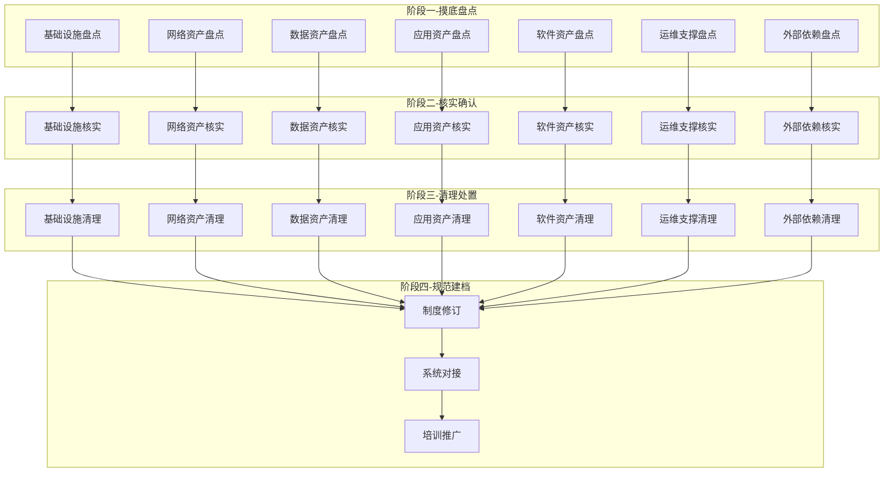
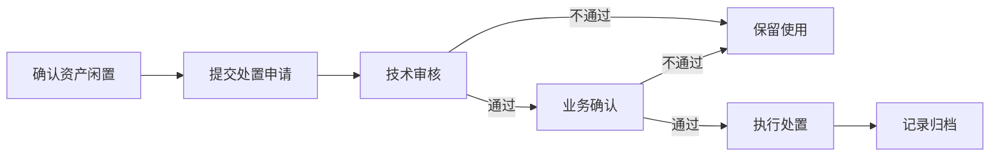
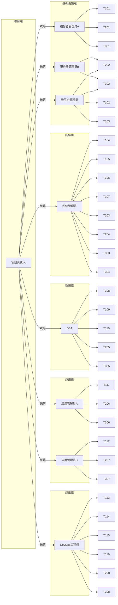
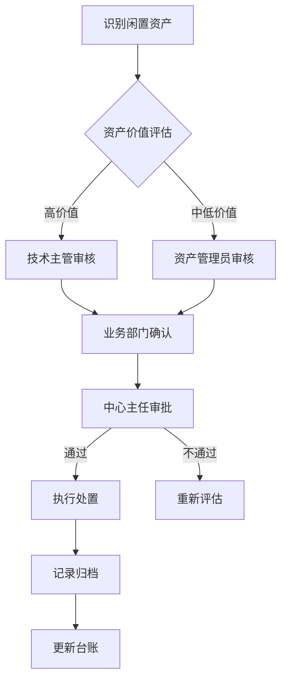
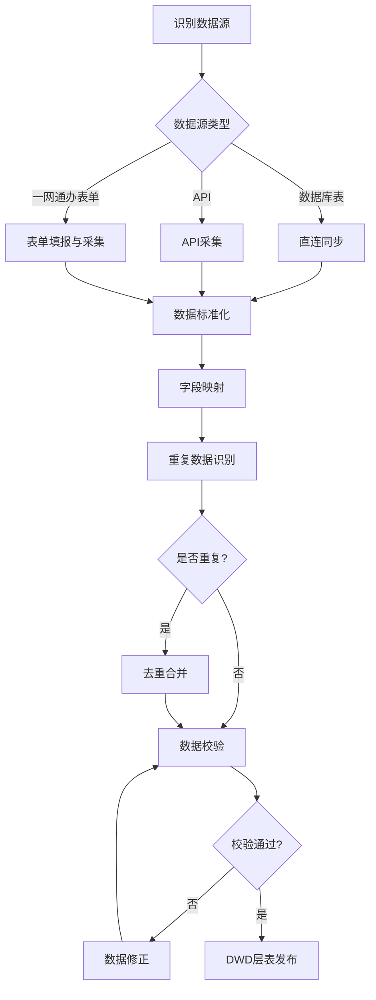
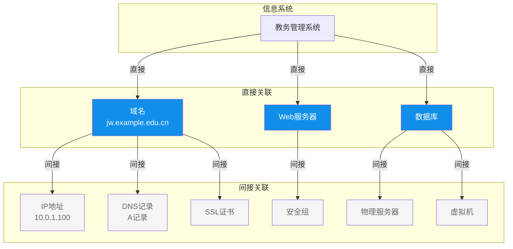

# IT资产清理专项任务书

## 一、任务概述

### 1.1 任务背景
随着学校信息化建设的持续推进，IT资产规模不断扩大，但部分资产存在**账实不符、状态不明、闲置浪费**等问题。为提升IT资产管理水平，保障信息系统安全稳定运行，特开展本次IT资产清理专项工作。

### 1.2 任务目标
| 目标类型 | 具体目标 | 衡量指标 |
|---------|---------|---------|
| **资产账实相符** | 建立准确完整的IT资产台账 | 账实相符率≥95% |
| **闲置资产清理** | 识别并处置长期闲置资产 | 闲置资产处置率≥80% |
| **安全风险消除** | 清理过期证书、无用账户等安全隐患 | 安全隐患清零 |
| **管理规范建立** | 建立IT资产管理长效机制 | 完成制度修订和系统上线 |

### 1.3 清理范围
覆盖全校所有信息系统及其关联的7大类IT资产：
- 基础设施层（物理设备、虚拟机、容器、集群、网络设备）
- 网络层（IP地址、域名、DNS记录、SSL证书、安全组）
- 数据层（数据库、缓存Redis、消息队列、存储系统、备份系统）
- 应用层（Web服务器、中间件、API网关、负载均衡、微服务）
- 软件层（操作系统、运行时环境、基础软件包）
- 运维支撑层（监控系统、日志系统、CI/CD流水线、代码仓库）
- 外部依赖层（第三方服务/SaaS、外部接口依赖）

### 1.4 时间规划
| 阶段 | 时间 | 周期 | 核心产出 |
|-----|------|------|---------|
| **第一阶段** | 第1-2个月 | 8周 | 8张DWD层资产表（完整资产清单） |
| **第二阶段** | 第3-4个月 | 8周 | 资产状态确认报告 |
| **第三阶段** | 第5-6个月 | 8周 | 闲置资产处置完成 |
| **第四阶段** | 第7个月（第25-28周） | 4周 | 管理制度与长效机制 |

**总周期**：28周（约7个月）

---

## 二、任务分解矩阵（阶段×资产域）

### 2.1 任务矩阵概览



### 2.2 第一阶段：摸底盘点（第1-2个月）

第一阶段的核心目标不是产出Excel盘点表，而是把7大类IT资产数据梳理为8张DWD层表发布到数据中台。每个子任务都要先明确数据源及数据源类型，再选择对应的集成路径。

#### 2.2.1 数据集成策略

| 数据源类型 | 判定标准 | 集成路径 | 数据落点 |
|-----------|---------|---------|---------|
| **数据库表** | 已有业务系统或管理平台以关系型/非关系型数据库存储资产数据，且具备只读访问权限 | 通过数据中台数据集成工具直连同步，或定时抽取 | 数据中台DWD层 |
| **API接口** | 资产数据由云平台、监控系统、DevOps工具等通过API提供 | 调用API读取数据，经标准化清洗后写入DWD层 | 数据中台DWD层 |
| **一网通办表单** | 无法通过技术手段自动获取，或数据分散在文档、台账、人工记录中 | 在一网通办平台建立表单应用，由责任人补充完善后，通过数据中台集成组件接入 | 数据中台DWD层 |

表中台DWD层表名统一采用 `itc_` 前缀（IT资产清理专项），例如 `itc_physical_device`。所有DWD层表均需在数据中台完成发布，发布后即为子任务完成标志。

#### 2.2.2 第一阶段任务明细

| 子任务 | 资产域 | 负责人 | 数据源 | 数据源类型 | 一网通办表单 | 产出（DWD层表） | 完成标准 |
|-------|-------|-------|--------|-----------|-------------|----------------|---------|
| **T1-01** | 物理设备 | 服务器管理员 | 资产登记系统 | 数据库表 | 《缺失物理设备补录表》（补充未录入的老旧设备） | `itc_physical_device` | 该表在数据中台发布，记录完整率≥98% |
| **T1-02** | 虚拟机 | 云平台管理员 | 云平台控制台 | API | — | `itc_virtual_asset` | 虚拟机部分数据在数据中台发布，覆盖全部云账号下的 VM |
| **T1-03** | 容器 | 云平台管理员 | 容器平台控制台 | API | — | `itc_virtual_asset` | 容器部分数据在数据中台发布，覆盖全部云账号下的容器 |
| **T1-04** | 网络设备 | 网络管理员 | 网络管理系统/CMDB | 数据库表 | — | `itc_network_device` | 该表在数据中台发布，记录完整率≥98% |
| **T1-05** | IP 地址 | 网络管理员 | IP 地址管理系统 | 数据库表 | 《IP地址使用补录表》（补充未系统管理的IP） | `itc_network_asset` | IP 地址部分数据在数据中台发布，覆盖全部在用 IP |
| **T1-06** | 域名 | 网络管理员 | DNS管理系统 | 数据库表 | — | `itc_network_asset` | 域名部分数据在数据中台发布，覆盖全部在用域名 |
| **T1-07** | SSL 证书 | 网络管理员 | 证书管理系统 | 数据库表 | — | `itc_network_asset` | 证书部分数据在数据中台发布，覆盖全部在用 SSL 证书 |
| **T1-08** | 数据库 | DBA | 数据库运维平台 | 数据库表/API | — | `itc_data_asset` | 数据库部分数据在数据中台发布，覆盖全部数据库实例 |
| **T1-09** | 缓存 Redis | DBA | Redis 管理平台 | 数据库表/API | — | `itc_data_asset` | Redis 部分数据在数据中台发布，覆盖全部 Redis 实例 |
| **T1-10** | 消息队列 MQ | DBA | 消息队列管理平台 | 数据库表/API | — | `itc_data_asset` | MQ 部分数据在数据中台发布，覆盖全部 MQ 实例 |
| **T1-11** | 应用系统 | 应用管理员 | 应用配置管理系统 | 数据库表 | 《应用系统信息补录表》 | `itc_application_asset` | 应用系统部分数据在数据中台发布，覆盖全部在运应用 |
| **T1-12** | 中间件 | 应用管理员 | 部署文档、中间件台账 | 数据库表/一网通办表单 | 《中间件信息补录表》 | `itc_application_asset` | 中间件部分数据在数据中台发布，覆盖全部在运中间件 |
| **T1-13** | 监控系统 | DevOps工程师 | 监控系统 | API/数据库表 | — | `itc_ops_support` | 监控系统部分数据在数据中台发布，覆盖全部监控工具及告警规则 |
| **T1-14** | 日志系统 | DevOps工程师 | 日志系统 | API/数据库表 | — | `itc_ops_support` | 日志系统部分数据在数据中台发布，覆盖全部日志采集/存储工具 |
| **T1-15** | CI/CD 流水线 | DevOps工程师 | CI/CD 系统 | API/数据库表 | — | `itc_ops_support` | CI/CD 部分数据在数据中台发布，覆盖全部流水线 |
| **T1-16** | 代码仓库 | DevOps工程师 | 代码仓库 | API/数据库表 | — | `itc_ops_support` | 代码仓库部分数据在数据中台发布，覆盖全部仓库 |
| **T1-17** | 第三方服务/SaaS | 系统分析师 | 第三方服务台账 | 一网通办表单 | 《第三方服务登记表》 | `itc_external_dependency` | 第三方服务部分数据在数据中台发布，覆盖全部外部服务 |
| **T1-18** | 外部接口依赖 | 系统分析师 | 接口文档 | 一网通办表单 | 《外部接口登记表》 | `itc_external_dependency` | 外部接口部分数据在数据中台发布，覆盖全部接口依赖 |

#### 2.2.3 阶段产出与完成标准

**阶段产出**：
- 数据中台DWD层8张资产主题表：`itc_physical_device`、`itc_virtual_asset`、`itc_network_device`、`itc_network_asset`、`itc_data_asset`、`itc_application_asset`、`itc_ops_support`、`itc_external_dependency`
- 《IT资产清理DWD层数据表清单（初稿）》

**完成标准**：
- 18个子任务对应的8张DWD层表全部在数据中台发布
- 每张表完成字段标准化、数据质量校验、主键唯一性校验
- 表间关联关系建立：物理设备/虚拟机/应用/数据资产通过 `system_id`、`asset_code` 等关键字段可交叉印证
- 无法自动采集的数据通过一网通办表单完成补录并接入表中台

---

### 2.3 第一阶段待办事项跟踪

本节专门用于跟踪第一阶段各子任务的执行进度。每个子任务按"数据源确认→集成方案确定→数据接入实施→数据质量校验→数据表发布"五个关键步骤设置待办。

| 子任务 | 资产域 | 待办事项 | 负责人 | 计划完成时间 | 实际完成时间 | 状态 |
|-------|-------|---------|-------|------------|------------|------|
| **T1-01** | 物理设备 | 1. 确认资产登记系统数据源及访问权限<br>2. 设计 `itc_physical_device` 表结构<br>3. 完成数据库直连同步<br>4. 建立一网通办缺失设备补录表单<br>5. 完成数据质量校验并发布DWD层表 | 服务器管理员 | 第1-4周 | | ☐ |
| **T1-02** | 虚拟机 | 1. 确认云平台虚拟机API及认证方式<br>2. 设计虚拟机相关字段及映射规则<br>3. 开发虚拟机数据采集脚本<br>4. 完成虚拟机数据标准化与去重<br>5. 发布虚拟机部分DWD层数据 | 云平台管理员 | 第1-4周 | | ☐ |
| **T1-03** | 容器 | 1. 确认容器平台API及认证方式<br>2. 设计容器相关字段及映射规则<br>3. 开发容器数据采集脚本<br>4. 完成容器数据标准化与去重<br>5. 发布容器部分DWD层数据 | 云平台管理员 | 第1-4周 | | ☐ |
| **T1-04** | 网络设备 | 1. 确认网络管理系统/CMDB数据源<br>2. 设计 `itc_network_device` 表结构<br>3. 完成数据库直连同步<br>4. 与网络拓扑进行交叉校验<br>5. 发布DWD层表 | 网络管理员 | 第1-4周 | | ☐ |
| **T1-05** | IP 地址 | 1. 确认IP地址管理数据源<br>2. 设计IP地址相关字段及映射规则<br>3. 完成系统可获取IP数据接入<br>4. 建立一网通办IP使用补录表单<br>5. 完成IP地址数据校验并发布 | 网络管理员 | 第3-6周 | | ☐ |
| **T1-06** | 域名 | 1. 确认DNS管理系统数据源<br>2. 设计域名相关字段及映射规则<br>3. 完成域名解析记录数据接入<br>4. 补充域名备案、到期等关键信息<br>5. 完成域名数据校验并发布 | 网络管理员 | 第3-6周 | | ☐ |
| **T1-07** | SSL 证书 | 1. 确认证书管理系统数据源<br>2. 设计SSL证书相关字段及映射规则<br>3. 完成证书数据接入<br>4. 完成证书过期时间与所属系统核对<br>5. 完成证书数据校验并发布 | 网络管理员 | 第3-6周 | | ☐ |
| **T1-08** | 数据库 | 1. 确认数据库运维平台数据源<br>2. 设计数据库相关字段及映射规则<br>3. 完成数据库实例数据接入<br>4. 完成数据库连接可用性校验<br>5. 完成数据库部分数据校验并发布 | DBA | 第3-6周 | | ☐ |
| **T1-09** | 缓存 Redis | 1. 确认Redis管理平台数据源<br>2. 设计Redis相关字段及映射规则<br>3. 完成Redis实例数据接入<br>4. 完成Redis连接可用性校验<br>5. 完成Redis部分数据校验并发布 | DBA | 第3-6周 | | ☐ |
| **T1-10** | 消息队列 MQ | 1. 确认消息队列管理平台数据源<br>2. 设计MQ相关字段及映射规则<br>3. 完成MQ实例数据接入<br>4. 完成MQ连接可用性校验<br>5. 完成MQ部分数据校验并发布 | DBA | 第3-6周 | | ☐ |
| **T1-11** | 应用系统 | 1. 确认应用配置管理系统数据源<br>2. 设计应用系统相关字段及映射规则<br>3. 完成可系统获取的应用数据接入<br>4. 建立一网通办应用系统信息补录表单<br>5. 完成应用系统数据校验并发布 | 应用管理员 | 第3-6周 | | ☐ |
| **T1-12** | 中间件 | 1. 确认中间件相关数据源及部署文档<br>2. 设计中间件相关字段及映射规则<br>3. 完成可系统获取的中间件数据接入<br>4. 建立一网通办中间件信息补录表单<br>5. 完成中间件数据校验并发布 | 应用管理员 | 第3-6周 | | ☐ |
| **T1-13** | 监控系统 | 1. 确认监控系统数据源及API<br>2. 设计监控系统相关字段及映射规则<br>3. 完成监控工具/告警规则数据接入<br>4. 完成监控工具可用性校验<br>5. 完成监控系统数据校验并发布 | DevOps工程师 | 第5-8周 | | ☐ |
| **T1-14** | 日志系统 | 1. 确认日志系统数据源及API<br>2. 设计日志系统相关字段及映射规则<br>3. 完成日志采集/存储工具数据接入<br>4. 完成日志工具可用性校验<br>5. 完成日志系统数据校验并发布 | DevOps工程师 | 第5-8周 | | ☐ |
| **T1-15** | CI/CD 流水线 | 1. 确认CI/CD平台数据源及API<br>2. 设计CI/CD流水线相关字段及映射规则<br>3. 完成流水线数据接入<br>4. 完成流水线有效性校验<br>5. 完成CI/CD数据校验并发布 | DevOps工程师 | 第5-8周 | | ☐ |
| **T1-16** | 代码仓库 | 1. 确认代码仓库平台数据源及API<br>2. 设计代码仓库相关字段及映射规则<br>3. 完成仓库数据接入<br>4. 完成仓库活跃度/负责人核对<br>5. 完成代码仓库数据校验并发布 | DevOps工程师 | 第5-8周 | | ☐ |
| **T1-17** | 第三方服务/SaaS | 1. 梳理全部第三方服务/SaaS清单<br>2. 设计第三方服务相关字段及映射规则<br>3. 建立一网通办第三方服务登记表<br>4. 组织各系统负责人完成填报<br>5. 完成第三方服务数据校验并发布 | 系统分析师 | 第5-8周 | | ☐ |
| **T1-18** | 外部接口依赖 | 1. 梳理全部外部接口依赖清单<br>2. 设计外部接口相关字段及映射规则<br>3. 建立一网通办外部接口登记表<br>4. 组织各系统负责人完成填报<br>5. 完成外部接口数据校验并发布 | 系统分析师 | 第5-8周 | | ☐ |

---

### 2.4 第二阶段：核实确认（第3-4个月）

第二阶段基于第一阶段已发布的DWD层表，对表中数据进行核实确认。输入不再是Excel盘点表，而是数据中台的DWD层表。

| 子任务 | 资产域 | 负责人 | 输入 | 产出 | 完成标准 |
|-------|-------|-------|------|------|---------|
| **T2-01** | 基础设施 | 服务器管理员 | `itc_physical_device` + `itc_virtual_asset` + 现场检查 | 《基础设施核实报告》 | 现场核实率100% |
| **T2-02** | 网络资产 | 网络管理员 | `itc_network_device` + `itc_network_asset` + 系统扫描 | 《网络资产核实报告》 | 扫描核实率100% |
| **T2-03** | 数据资产 | DBA | `itc_data_asset` + 连接测试 | 《数据资产核实报告》 | 连接测试率100% |
| **T2-04** | 应用资产 | 应用管理员 | `itc_application_asset` + 运行检查 | 《应用资产核实报告》 | 运行检查率100% |
| **T2-05** | 软件资产 | 应用管理员 | `itc_application_asset` + 版本核对 | 《软件资产核实报告》 | 版本核对率100% |
| **T2-06** | 运维支撑 | DevOps工程师 | `itc_ops_support` + 工具验证 | 《运维支撑核实报告》 | 工具验证率100% |
| **T2-07** | 外部依赖 | 系统分析师 | `itc_external_dependency` + 接口测试 | 《外部依赖核实报告》 | 接口测试率100% |

**阶段产出**：《云南大学IT资产状态确认报告》

**完成标准**：
- 所有资产状态明确：在用/闲置/废弃/待确认
- 闲置资产定义：连续3个月以上无访问记录或无业务关联
- 待确认资产：无法确定状态的资产清单（需业务部门确认）
- 建立资产与业务系统的关联关系

**风险控制**：
- 对于待确认资产，必须通过邮件或工单方式联系业务部门确认
- 确认周期不超过2周，逾期未回复视为"待评估"

---

### 2.5 第三阶段：清理处置（第5-6个月）

| 子任务 | 资产域 | 负责人 | 输入 | 产出 | 完成标准 |
|-------|-------|-------|------|------|---------|
| **T3-01** | 物理设备 | 服务器管理员 | 核实报告 | 《设备处置记录》 | 闲置设备100%处置 |
| **T3-02** | 虚拟机/容器 | 云平台管理员 | 核实报告 | 《资源释放记录》 | 闲置资源100%释放 |
| **T3-03** | 网络资产 | 网络管理员 | 核实报告 | 《网络清理记录》 | 无用IP/域名100%回收 |
| **T3-04** | 数据资产 | DBA | 核实报告 | 《数据清理记录》 | 废弃数据100%归档/删除 |
| **T3-05** | 应用资产 | 应用管理员 | 核实报告 | 《应用下线记录》 | 废弃应用100%下线 |
| **T3-06** | 运维支撑 | DevOps工程师 | 核实报告 | 《工具清理记录》 | 无用工具100%清理 |
| **T3-07** | 外部依赖 | 系统分析师 | 核实报告 | 《依赖清理记录》 | 无效依赖100%清理 |

**阶段产出**：《云南大学IT资产清理处置报告》

**完成标准**：
- 闲置资产处置率≥80%
- 处置方式明确：报废、回收、捐赠、转售、归档
- 所有处置均有审批记录和操作日志
- 无在用资产被误处置

**审批流程**：


---

### 2.6 第四阶段：规范建档（第7个月）

| 子任务 | 负责人 | 输入 | 产出 | 完成标准 |
|-------|-------|------|------|---------|
| **T4-01** | 技术主管 | 清理报告 | 《IT资产管理办法》修订版 | 制度发布生效 |
| **T4-02** | 系统工程师 | 8张DWD层资产表 | CMDB系统数据录入（由DWD层表同步） | 数据完整率100% |
| **T4-03** | 培训专员 | 管理制度 | 培训材料+培训记录 | 覆盖率100% |
| **T4-04** | 技术主管 | 全部资料 | 专项工作总结报告 | 通过验收 |

**阶段产出**：《云南大学IT资产管理规范》、《CMDB系统初始化数据》、《培训材料》

**完成标准**：
- 管理制度涵盖资产全生命周期管理
- CMDB系统完成数据对接和初始化
- 所有相关人员完成培训
- 建立资产定期盘点机制（每季度）

---

## 三、人员分工与职责

### 3.1 角色定义

| 角色 | 职责 | 建议人数 |
|-----|------|---------|
| **项目负责人** | 统筹协调、进度把控、资源调配 | 1人 |
| **服务器管理员** | 物理设备的盘点与清理 | 1-2人 |
| **云平台管理员** | 虚拟机、容器、云平台资源的盘点与清理 | 1人 |
| **网络管理员** | 网络设备、IP、域名、证书的盘点与清理 | 1-2人 |
| **DBA** | 数据库、缓存、MQ的盘点与清理 | 1人 |
| **应用管理员** | 应用、中间件、软件的盘点与清理 | 1-2人 |
| **DevOps工程师** | 运维支撑工具的盘点与清理 | 1人 |
| **系统分析师** | 外部依赖梳理、流程设计 | 1人 |

### 3.2 任务分配示意



---

## 四、进度跟踪与里程碑

### 4.1 周进度跟踪表

| 周次 | 阶段 | 重点任务 | 交付物 | 状态 |
|-----|------|---------|-------|------|
| 1-2 | 一 | 数据源确认、培训、DWD表结构设计 | 8张DWD层表结构文档 | ☐ |
| 3-4 | 一 | 物理设备/虚拟机/容器数据接入 | `itc_physical_device`、`itc_virtual_asset` 发布 | ☐ |
| 5-6 | 一 | 网络设备/网络资产/数据资产数据接入 | `itc_network_device`、`itc_network_asset`、`itc_data_asset` 发布 | ☐ |
| 7-8 | 一 | 应用资产/运维支撑/外部依赖数据接入 | `itc_application_asset`、`itc_ops_support`、`itc_external_dependency` 发布 | ☐ |
| 9-10 | 二 | 基础设施核实 | 《基础设施核实报告》 | ☐ |
| 11-12 | 二 | 网络/数据资产核实 | 《网络/数据核实报告》 | ☐ |
| 13-14 | 二 | 应用/运维/外部依赖核实 | 《应用/运维/外部依赖核实报告》 | ☐ |
| 15-16 | 二 | 汇总确认、生成状态报告 | 《资产状态确认报告》 | ☐ |
| 17-18 | 三 | 基础设施清理 | 《设备处置记录》 | ☐ |
| 19-20 | 三 | 网络/数据资产清理 | 《网络/数据清理记录》 | ☐ |
| 21-22 | 三 | 应用/运维/外部依赖清理 | 《应用/运维/外部依赖清理记录》 | ☐ |
| 23-24 | 三 | 汇总清理、生成处置报告 | 《资产清理处置报告》 | ☐ |
| 25-26 | 四 | 制度修订、CMDB录入 | 《管理制度》、CMDB数据 | ☐ |
| 27-28 | 四 | 培训推广、总结验收 | 培训记录、总结报告 | ☐ |

### 4.2 里程碑节点

| 里程碑 | 时间 | 标志事件 | 验收标准 |
|-------|------|---------|---------|
| **M1** | 第2个月 | DWD层资产表初稿完成 | 8张DWD层资产表在数据中台全部发布 |
| **M2** | 第4个月 | 资产状态确认完成 | 《资产状态确认报告》通过评审 |
| **M3** | 第6个月 | 清理处置完成 | 《资产清理处置报告》通过评审 |
| **M4** | 第7个月 | 专项工作验收 | 管理制度发布、CMDB上线、培训完成 |

---

## 五、风险控制与保障措施

### 5.1 风险识别与应对

| 风险 | 等级 | 应对措施 |
|-----|------|---------|
| 误处置在用资产 | 高 | 建立三级确认机制：技术确认→业务确认→领导审批 |
| 业务部门配合度低 | 中 | 提前发通知、明确时间节点、纳入部门绩效考核 |
| 资产数据缺失严重 | 中 | 采用多种手段交叉验证：系统扫描+现场核查+文档核对 |
| 清理过程影响业务 | 中 | 选择业务低峰期操作、制定回滚方案、提前通知业务方 |
| 人员变动影响进度 | 低 | 任务交接文档化、关键任务双人备份 |

### 5.2 资产处置审批流程



### 5.3 回滚机制
- 所有资产清理操作前必须进行数据备份
- 清理操作必须记录详细日志（操作人、时间、内容、影响范围）
- 建立7天回滚窗口，清理后7天内如发现误操作可恢复

---

## 六、组织保障与沟通机制

### 6.1 领导小组

| 角色 | 姓名 | 职务 | 职责 |
|-----|------|------|------|
| **组长** | 信息技术中心主任 | 全面负责专项任务的统筹、决策和资源调配 | |
| **副组长** | 信息技术中心副主任 | 协助组长推进工作，负责技术方案审核和跨部门协调 | |
| **成员** | 各科室负责人 | 参与重大事项决策，协调本科室资源配合专项任务 | |

### 6.2 工作小组

| 小组名称 | 负责人 | 成员 | 职责范围 |
|---------|-------|------|---------|
| **项目管理组** | 项目负责人 | 项目协调员 | 进度跟踪、文档管理、会议组织 |
| **基础设施组** | 服务器管理员 | 硬件维护人员 | 物理设备的盘点与清理 |
| **云平台组** | 云平台管理员 | 云平台工程师 | 虚拟机、容器、云平台资源的盘点与清理 |
| **网络组** | 网络管理员 | 网络工程师 | 网络设备、IP、域名、证书的盘点与清理 |
| **数据组** | DBA | 数据工程师 | 数据库、缓存、MQ的盘点与清理 |
| **应用组** | 应用管理员 | 系统开发人员 | 应用、中间件、软件的盘点与清理 |
| **运维组** | DevOps工程师 | 运维人员 | 运维支撑工具的盘点与清理 |
| **分析组** | 系统分析师 | 业务分析师 | 外部依赖梳理、流程设计、报表分析 |

### 6.3 沟通机制

#### 6.3.1 内部沟通

| 会议类型 | 频率 | 参与人员 | 内容 |
|---------|------|---------|------|
| **项目周例会** | 每周一上午 | 全体工作小组成员 | 进度汇报、问题讨论、任务调整 |
| **阶段评审会** | 每个阶段结束前1周 | 领导小组+工作小组负责人 | 阶段成果评审、下一阶段计划确认 |
| **专项协调会** | 按需 | 相关人员 | 特定问题的专题讨论和协调 |

#### 6.3.2 跨部门沟通

| 沟通方式 | 对象 | 频率 | 内容 |
|---------|------|------|------|
| **资产确认通知** | 各业务部门资产联系人 | 第二阶段开始时 | 发送待确认资产清单，要求业务部门确认 |
| **业务部门协调会** | 各业务部门负责人 | 第一阶段启动后 | 说明清理工作意义和配合要求 |
| **进度通报** | 各业务部门 | 每月 | 发送月度进度通报，告知清理进展 |
| **清理公告** | 全校 | 第三阶段开始前 | 发布清理公告，提醒相关业务部门注意 |

#### 6.3.3 汇报机制

| 汇报对象 | 频率 | 内容 |
|---------|------|------|
| **分管校领导** | 每月 | 专项工作月度进展报告 |
| **学校信息化工作领导小组** | 每个阶段结束后 | 阶段成果汇报 |
| **全校** | 专项工作结束后 | 工作总结通报 |

### 6.4 文档管理

| 文档类型 | 存储位置 | 更新频率 | 责任人 |
|---------|---------|---------|-------|
| DWD层表 | 数据中台 | 按数据源同步周期更新 | 各资产管理员 |
| 核实报告 | 共享盘/专项文件夹/核实报告 | 阶段结束前 | 各小组负责人 |
| 进度跟踪表 | 共享盘/专项文件夹/进度跟踪 | 每周 | 项目协调员 |
| 会议纪要 | 共享盘/专项文件夹/会议纪要 | 每次会议后 | 项目协调员 |
| 审批文件 | 共享盘/专项文件夹/审批文件 | 实时 | 资产管理员 |

---

## 七、数据整合策略

### 7.1 现有数据来源分析

| 数据源 | 数据类型 | 数据源类型 | 完整性 | 集成方式 |
|-------|---------|-----------|-------|---------|
| 资产登记系统 | 物理设备、软件许可证 | 数据库表 | 部分完整 | 直连同步至 `itc_physical_device` |
| 云平台控制台 | 虚拟机、容器、存储 | API | 完整 | API采集至 `itc_virtual_asset` |
| 网络管理系统/CMDB | 网络设备 | 数据库表 | 部分完整 | 直连同步至 `itc_network_device` |
| DNS管理系统 | 域名、DNS记录 | 数据库表 | 完整 | 直连同步至 `itc_network_asset` |
| 证书管理系统 | SSL证书 | 数据库表 | 完整 | 直连同步至 `itc_network_asset` |
| 数据库运维平台 | 数据库实例 | 数据库表/API | 部分完整 | 直连或API接入 `itc_data_asset` |
| 中间件管理平台 | Redis、消息队列 | 数据库表/API | 部分完整 | 直连或API接入 `itc_data_asset` |
| 应用配置管理系统 | 应用、中间件 | 数据库表 | 部分完整 | 直连同步至 `itc_application_asset` |
| 部署文档/人工台账 | 应用、中间件 | 一网通办表单 | 部分完整 | 一网通办表单补录后接入 `itc_application_asset` |
| 监控系统/日志系统/CI/CD/代码仓库 | 运维支撑工具 | API/数据库表 | 完整 | API或直连接入 `itc_ops_support` |
| 接口文档/第三方服务台账 | 外部依赖 | 一网通办表单 | 部分完整 | 一网通办表单补录后接入 `itc_external_dependency` |

### 7.2 数据清洗与入仓流程



### 7.3 数据标准化规则

| 字段 | 标准化规则 | 示例 |
|-----|-----------|------|
| 资产编码 | 统一格式：{类型前缀}-{年份}-{序号} | SVR-2024-001 |
| 资产类型 | 统一使用7大类分类：基础设施、网络、数据、应用、软件、运维支撑、外部依赖 | 基础设施-物理设备 |
| 状态 | 统一使用：在用/闲置/废弃/待确认 | 在用 |
| 负责人 | 使用工号+姓名格式 | 2024001-张三 |
| 位置 | 使用标准位置编码 | 机房A-机柜01-U12 |
| 配置信息 | 使用JSON格式存储 | {"cpu":"24核","memory":"64GB","disk":"2TB"} |

### 7.4 数据质量检查清单

| 检查项 | 检查方法 | 合格标准 |
|-------|---------|---------|
| 完整性 | 检查必填字段是否为空 | 必填字段完整率≥98% |
| 一致性 | 检查同一资产在不同系统中的信息是否一致 | 一致性≥95% |
| 唯一性 | 检查资产编码是否唯一 | 无重复编码 |
| 准确性 | 抽样检查资产实际状态与记录是否一致 | 准确率≥95% |
| 时效性 | 检查数据更新时间是否在合理范围内 | 近6个月内有更新 |

### 7.5 数据整合工具

| 工具 | 用途 | 负责人 |
|-----|------|-------|
| 数据中台数据集成工具 | 数据库直连同步、API采集、表单数据接入 | DevOps工程师 |
| 一网通办平台 | 无法自动采集数据的人工补录表单 | 系统分析师 |
| Python脚本 | 批量数据处理、去重合并、字段标准化 | 系统分析师 |
| 数据中台DWD层 | 第一阶段资产主题表统一存储与发布 | 系统工程师 |
| CMDB系统 | 第四阶段由DWD层表同步，作为最终消费方 | 系统工程师 |
| 数据同步工具 | DWD层表与CMDB之间的定期同步 | DevOps工程师 |

---

## 八、人员任务排期表

### 8.1 服务器管理员任务排期

| 周次 | 阶段 | 任务描述 | 交付物 | 状态 |
|-----|------|---------|-------|------|
| 1-2 | 一 | 数据源确认、培训、DWD表结构设计 | `itc_physical_device` 表结构文档 | ☐ |
| 3-4 | 一 | 资产登记系统数据接入 | `itc_physical_device` 初版发布 | ☐ |
| 5-6 | 一 | 缺失设备一网通办表单补录 | 补录数据接入 `itc_physical_device` | ☐ |
| 7-8 | 一 | 数据校验、交叉校验、表发布 | `itc_physical_device` 正式发布 | ☐ |
| 9-10 | 二 | 物理设备现场核实 | 《基础设施核实报告-物理设备》 | ☐ |
| 11-12 | 二 | 物理设备与DWD层表核对 | 《基础设施核实报告-物理设备核对》 | ☐ |
| 13-14 | 二 | 核实数据汇总 | 《基础设施核实报告-物理设备》 | ☐ |
| 17-18 | 三 | 闲置物理设备处置 | 《设备处置记录》 | ☐ |
| 19-20 | 三 | 报废设备归档 | 《设备处置记录-归档》 | ☐ |
| 21-22 | 三 | 处置数据汇总 | 《基础设施清理记录-物理设备》 | ☐ |

### 8.2 网络管理员任务排期

| 周次 | 阶段 | 任务描述 | 交付物 | 状态 |
|-----|------|---------|-------|------|
| 1-2 | 一 | 数据源确认、培训、DWD表结构设计 | `itc_network_device` / `itc_network_asset` 表结构文档 | ☐ |
| 3-4 | 一 | 网络设备数据接入 | `itc_network_device` 发布 | ☐ |
| 5-6 | 一 | DNS/证书数据接入，IP地址一网通办表单补录 | `itc_network_asset` 发布 | ☐ |
| 7-8 | 一 | 安全组/防火墙规则补充、数据校验 | `itc_network_asset` 正式发布 | ☐ |
| 9-10 | 二 | 网络设备扫描核实 | 《网络资产核实报告-设备》 | ☐ |
| 11-12 | 二 | IP/域名/证书核实 | 《网络资产核实报告-资产》 | ☐ |
| 13-14 | 二 | 核实数据汇总 | 《网络资产核实报告》 | ☐ |
| 17-18 | 三 | 无用IP/域名回收 | 《网络清理记录-IP/域名》 | ☐ |
| 19-20 | 三 | 过期证书清理 | 《网络清理记录-证书》 | ☐ |
| 21-22 | 三 | 安全组规则清理 | 《网络清理记录-安全组》 | ☐ |

### 8.3 DBA任务排期

| 周次 | 阶段 | 任务描述 | 交付物 | 状态 |
|-----|------|---------|-------|------|
| 1-2 | 一 | 数据源确认、培训、DWD表结构设计 | `itc_data_asset` 表结构文档 | ☐ |
| 3-4 | 一 | 数据库实例数据接入 | `itc_data_asset` 数据库部分发布 | ☐ |
| 5-6 | 一 | 缓存Redis/消息队列数据接入 | `itc_data_asset` 缓存/MQ部分发布 | ☐ |
| 7-8 | 一 | 存储/备份系统数据接入、连接校验 | `itc_data_asset` 正式发布 | ☐ |
| 9-10 | 二 | 数据库连接测试核实 | 《数据资产核实报告-数据库》 | ☐ |
| 11-12 | 二 | Redis/MQ/存储核实 | 《数据资产核实报告-其他》 | ☐ |
| 13-14 | 二 | 核实数据汇总 | 《数据资产核实报告》 | ☐ |
| 17-18 | 三 | 废弃数据库清理 | 《数据清理记录-数据库》 | ☐ |
| 19-20 | 三 | 无用缓存/MQ清理 | 《数据清理记录-Redis/MQ》 | ☐ |
| 21-22 | 三 | 过期备份清理 | 《数据清理记录-备份》 | ☐ |

### 8.4 应用管理员任务排期

| 周次 | 阶段 | 任务描述 | 交付物 | 状态 |
|-----|------|---------|-------|------|
| 1-2 | 一 | 数据源确认、培训、DWD表结构设计 | `itc_application_asset` 表结构文档 | ☐ |
| 3-4 | 一 | 应用配置管理系统可接入数据同步 | `itc_application_asset` 初版发布 | ☐ |
| 5-6 | 一 | 建立一网通办应用与中间件补录表单 | 表单上线、组织填报 | ☐ |
| 7-8 | 一 | 补录数据接入、运行校验、表发布 | `itc_application_asset` 正式发布 | ☐ |
| 9-10 | 二 | 应用运行状态检查 | 《应用资产核实报告-运行状态》 | ☐ |
| 11-12 | 二 | 版本/配置核对 | 《应用资产核实报告-版本配置》 | ☐ |
| 13-14 | 二 | 核实数据汇总 | 《应用资产核实报告》 | ☐ |
| 17-18 | 三 | 废弃应用下线 | 《应用下线记录》 | ☐ |
| 19-20 | 三 | 无用中间件清理 | 《应用清理记录-中间件》 | ☐ |
| 21-22 | 三 | 过期软件包清理 | 《应用清理记录-软件》 | ☐ |

### 8.5 DevOps工程师任务排期

| 周次 | 阶段 | 任务描述 | 交付物 | 状态 |
|-----|------|---------|-------|------|
| 1-2 | 一 | 数据源确认、培训、DWD表结构设计 | `itc_ops_support` 表结构文档 | ☐ |
| 3-4 | 一 | 监控系统/日志系统数据接入 | `itc_ops_support` 监控/日志部分发布 | ☐ |
| 5-6 | 一 | CI/CD流水线/代码仓库数据接入 | `itc_ops_support` 流水线/仓库部分发布 | ☐ |
| 7-8 | 一 | 工具可用性校验、表发布 | `itc_ops_support` 正式发布 | ☐ |
| 9-10 | 二 | 监控/日志工具验证 | 《运维支撑核实报告-监控/日志》 | ☐ |
| 11-12 | 二 | 流水线/仓库验证 | 《运维支撑核实报告-流水线/仓库》 | ☐ |
| 13-14 | 二 | 核实数据汇总 | 《运维支撑核实报告》 | ☐ |
| 17-18 | 三 | 无用监控/日志清理 | 《工具清理记录-监控/日志》 | ☐ |
| 19-20 | 三 | 无效流水线清理 | 《工具清理记录-流水线》 | ☐ |
| 21-22 | 三 | 废弃代码仓库归档 | 《工具清理记录-仓库》 | ☐ |

### 8.6 系统分析师任务排期

| 周次 | 阶段 | 任务描述 | 交付物 | 状态 |
|-----|------|---------|-------|------|
| 1-2 | 一 | 数据源确认、培训、DWD表结构设计 | `itc_external_dependency` 表结构文档 | ☐ |
| 3-4 | 一 | 建立一网通办外部依赖登记表 | 表单上线 | ☐ |
| 5-6 | 一 | 组织各系统负责人完成外部依赖填报 | 填报数据接入 `itc_external_dependency` | ☐ |
| 7-8 | 一 | 依赖关系梳理、数据清洗、表发布 | `itc_external_dependency` 正式发布 | ☐ |
| 9-10 | 二 | 第三方服务接口测试 | 《外部依赖核实报告-服务》 | ☐ |
| 11-12 | 二 | 外部接口连通性测试 | 《外部依赖核实报告-接口》 | ☐ |
| 13-14 | 二 | 核实数据汇总、数据整合 | 《外部依赖核实报告》 | ☐ |
| 17-18 | 三 | 无效第三方服务清理 | 《依赖清理记录-服务》 | ☐ |
| 19-20 | 三 | 废弃接口清理 | 《依赖清理记录-接口》 | ☐ |
| 21-22 | 三 | 清理数据汇总、报表分析 | 《依赖清理记录》 | ☐ |

### 8.7 云平台管理员任务排期

| 周次 | 阶段 | 任务描述 | 交付物 | 状态 |
|-----|------|---------|-------|------|
| 1-2 | 一 | 数据源确认、培训、DWD表结构设计 | `itc_virtual_asset` 表结构文档 | ☐ |
| 3-4 | 一 | 云平台API对接、数据采集脚本开发 | `itc_virtual_asset` 初版发布 | ☐ |
| 5-6 | 一 | 多账号/多集群数据接入 | `itc_virtual_asset` 覆盖全部云资源 | ☐ |
| 7-8 | 一 | 数据去重、标准化、表发布 | `itc_virtual_asset` 正式发布 | ☐ |
| 9-10 | 二 | 虚拟机/容器运行状态核实 | 《基础设施核实报告-虚拟化》 | ☐ |
| 11-12 | 二 | 云平台资源与业务系统关联核对 | 《基础设施核实报告-云资源关联》 | ☐ |
| 13-14 | 二 | 核实数据汇总 | 《基础设施核实报告-虚拟化》 | ☐ |
| 17-18 | 三 | 闲置虚拟机/容器释放 | 《资源释放记录》 | ☐ |
| 19-20 | 三 | 过期镜像/快照清理 | 《资源释放记录-镜像快照》 | ☐ |
| 21-22 | 三 | 处置数据汇总 | 《基础设施清理记录-虚拟化》 | ☐ |

### 8.8 项目负责人任务排期

| 周次 | 阶段 | 任务描述 | 交付物 | 状态 |
|-----|------|---------|-------|------|
| 1-2 | 一 | 项目启动、方案制定、培训组织 | 项目计划、培训材料 | ☐ |
| 3-8 | 一 | 进度跟踪、问题协调、跨部门沟通 | 周进度报告 | ☐ |
| 9-16 | 二 | 阶段评审组织、问题协调 | 《资产状态确认报告》 | ☐ |
| 17-24 | 三 | 清理审批、风险控制、进度把控 | 《资产清理处置报告》 | ☐ |
| 25-28 | 四 | 制度修订审核、验收组织、总结报告 | 《专项工作总结报告》 | ☐ |

---

## 九、交付物清单

| 编号 | 交付物名称 | 交付时间 | 责任人 | 归档位置 |
|-----|-----------|---------|-------|---------|
| D-01 | 数据中台DWD层表 `itc_physical_device` | 第2个月 | 服务器管理员 | 数据中台 |
| D-02 | 数据中台DWD层表 `itc_virtual_asset` | 第2个月 | 云平台管理员 | 数据中台 |
| D-03 | 数据中台DWD层表 `itc_network_device` | 第2个月 | 网络管理员 | 数据中台 |
| D-04 | 数据中台DWD层表 `itc_network_asset` | 第2个月 | 网络管理员 | 数据中台 |
| D-05 | 数据中台DWD层表 `itc_data_asset` | 第2个月 | DBA | 数据中台 |
| D-06 | 数据中台DWD层表 `itc_application_asset` | 第2个月 | 应用管理员 | 数据中台 |
| D-07 | 数据中台DWD层表 `itc_ops_support` | 第2个月 | DevOps工程师 | 数据中台 |
| D-08 | 数据中台DWD层表 `itc_external_dependency` | 第2个月 | 系统分析师 | 数据中台 |
| D-09 | 《IT资产清理DWD层数据表清单（初稿）》 | 第2个月 | 项目负责人 | 共享盘/专项文件夹 |
| D-10 | 《资产状态确认报告》 | 第4个月 | 项目负责人 | 共享盘/专项文件夹 |
| D-11 | 《资产清理处置报告》 | 第6个月 | 项目负责人 | 共享盘/专项文件夹 |
| D-12 | 《IT资产管理办法（修订版）》 | 第7个月 | 技术主管 | 中心制度汇编 |
| D-13 | CMDB系统初始化数据（由DWD层表同步） | 第7个月 | 系统工程师 | CMDB系统 |
| D-14 | 《培训材料》 | 第7个月 | 培训专员 | 共享盘/培训文件夹 |
| D-15 | 《专项工作总结报告》 | 第7个月 | 项目负责人 | 中心文档库 |

---

## 十、资产关联关系梳理

### 10.1 资产分层与类型概览

**设计原则**：将Redis缓存、消息队列、Nacos等统一归为「中间件」类型，通过「名称」字段来区分具体的中间件类型（如redis、nacos、kafka、rabbitmq等），减少资产类别数量，简化系统开发。

| 分层 | 资产类型 | 代码标识 | 说明 |
|-----|---------|---------|------|
| **基础设施层** | 物理设备 | physical_device | 服务器、存储设备等 |
| | 虚拟机 | virtual_machine | VM实例 |
| | 容器/Pod | container | Docker/K8s容器 |
| | 集群 | cluster | K8s集群、Redis集群等 |
| | 网络设备 | network_device | 交换机、路由器、防火墙 |
| **网络层** | IP地址 | ip_address | 公网/私网IP |
| | 域名 | domain | 网站域名 |
| | DNS记录 | dns_record | DNS解析记录 |
| | SSL证书 | ssl_certificate | HTTPS证书 |
| | 安全组 | security_group | 防火墙规则 |
| **数据层** | 数据库 | database | MySQL、PostgreSQL、Oracle等 |
| | 存储系统 | storage | 存储设备、云存储 |
| | 备份系统 | backup | 备份服务 |
| **应用层** | Web服务器 | web_server | Nginx、Apache等 |
| | 中间件 | middleware | Redis、消息队列、Nacos、Tomcat等（通过name字段区分） |
| | API网关 | api_gateway | Kong、Spring Cloud Gateway等 |
| | 负载均衡 | load_balancer | F5、Nginx等 |
| | 微服务 | microservice | 微服务应用 |
| **软件层** | 操作系统 | operating_system | Linux、Windows等 |
| | 运行时 | runtime | JDK、Node.js等 |
| | 软件包 | software_package | 各类软件包 |
| **运维支撑层** | 监控系统 | monitoring | Prometheus、Zabbix等 |
| | 日志系统 | logging | ELK、Loki等 |
| | CI/CD流水线 | pipeline | Jenkins、GitLab CI等 |
| | 代码仓库 | code_repository | GitLab、GitHub等 |
| **外部依赖层** | 第三方服务 | third_party_service | 阿里云、腾讯云等SaaS服务 |
| | 外部接口 | external_api | 外部系统API接口 |

#### 10.1.1 中间件名称枚举

中间件通过「名称」字段来识别具体类型，以下是常见中间件名称枚举：

| 名称 | 中文说明 | 用途分类 |
|-----|---------|---------|
| redis | Redis缓存 | 缓存服务 |
| memcached | Memcached | 缓存服务 |
| rabbitmq | RabbitMQ | 消息队列 |
| kafka | Kafka | 消息队列 |
| rocketmq | RocketMQ | 消息队列 |
| activemq | ActiveMQ | 消息队列 |
| nacos | Nacos | 服务注册与配置中心 |
| consul | Consul | 服务注册与配置中心 |
| etcd | etcd | 分布式键值存储/配置中心 |
| zookeeper | ZooKeeper | 分布式协调服务 |
| tomcat | Tomcat | Web应用服务器 |
| jetty | Jetty | Web应用服务器 |
| weblogic | WebLogic | 应用服务器 |
| websphere | WebSphere | 应用服务器 |
| solr | Solr | 全文检索 |
| elasticsearch | Elasticsearch | 全文检索/日志分析 |

### 10.2 资产直接关联关系

**直接关联**指资产之间通过外键或明确的依赖字段直接建立的关联关系，这些关联会在对应页面的"关联资产"部分直接展示。

```mermaid
graph LR
    subgraph 信息系统[信息系统]
        SYS[系统实例]
    end
    
    subgraph 基础设施层
        PHY[物理设备]
        VM[虚拟机]
        CT[容器]
        CL[集群]
        NW[网络设备]
    end
    
    subgraph 网络层
        IP[IP地址]
        DM[域名]
        DNS[DNS记录]
        SSL[SSL证书]
        SG[安全组]
    end
    
    subgraph 数据层
        DB[数据库]
        STO[存储]
        BKP[备份]
    end
    
    subgraph 应用层
        WEB[Web服务器]
        MID[中间件<br>(Redis/MQ/Nacos等)]
        GW[API网关]
        LB[负载均衡]
        MS[微服务]
    end
    
    subgraph 运维支撑层
        MON[监控]
        LOG[日志]
        PIP[流水线]
        REPO[代码仓库]
    end
    
    subgraph 外部依赖层
        TPS[第三方服务]
        EXT[外部接口]
    end
    
    SYS --> PHY
    SYS --> VM
    SYS --> DB
    SYS --> MID
    SYS --> WEB
    SYS --> MS
    SYS --> MON
    SYS --> LOG
    SYS --> PIP
    SYS --> REPO
    SYS --> TPS
    SYS --> EXT
    
    VM --> PHY
    CT --> CL
    CL --> PHY
    
    DM --> IP
    DM --> SSL
    DNS --> DM
    
    WEB --> DM
    WEB --> SG
    
    MS --> DB
    MS --> MID
    
    LB --> WEB
    GW --> MS
    
    PIP --> REPO
    
    BKP --> DB
    BKP --> STO
    
    MON --> DB
    LOG --> DB
```

#### 10.2.1 信息系统直接关联的资产类型

| 资产类型 | 关联描述 | 显示位置 |
|---------|---------|---------|
| 物理设备 | 系统部署的物理服务器 | 信息系统详情页-关联资产 |
| 虚拟机 | 系统运行的虚拟机实例 | 信息系统详情页-关联资产 |
| 数据库 | 系统使用的数据库实例 | 信息系统详情页-关联资产 |
| 中间件 | 系统使用的中间件服务（Redis、消息队列、Nacos等） | 信息系统详情页-关联资产 |
| Web服务器 | 系统的Web服务节点 | 信息系统详情页-关联资产 |
| API网关 | 系统的API网关 | 信息系统详情页-关联资产 |
| 负载均衡 | 系统的负载均衡 | 信息系统详情页-关联资产 |
| 微服务 | 系统的微服务组件 | 信息系统详情页-关联资产 |
| 域名 | 系统对外提供服务的域名 | 信息系统详情页-关联资产 |
| SSL证书 | 系统域名使用的SSL证书 | 信息系统详情页-关联资产 |
| 监控系统 | 系统的监控工具 | 信息系统详情页-关联资产 |
| 日志系统 | 系统的日志采集工具 | 信息系统详情页-关联资产 |
| CI/CD流水线 | 系统的自动化部署流水线 | 信息系统详情页-关联资产 |
| 代码仓库 | 系统的代码存储仓库 | 信息系统详情页-关联资产 |
| 第三方服务 | 系统依赖的外部SaaS服务 | 信息系统详情页-关联资产 |
| 外部接口 | 系统调用的外部API接口 | 信息系统详情页-关联资产 |

#### 10.2.2 资产间直接关联关系表

| 源资产类型 | 目标资产类型 | 关系类型 | 关联字段 | 说明 |
|-----------|------------|---------|---------|------|
| 虚拟机 | 物理设备 | runs_on | physical_device_id | 虚拟机运行在物理设备上 |
| 容器 | 集群 | runs_on | cluster_id | 容器运行在集群中 |
| 集群 | 物理设备 | runs_on | nodes.physical_device_id | 集群节点部署在物理设备上 |
| 域名 | IP地址 | points_to | ip_address_id | 域名解析到IP地址 |
| 域名 | SSL证书 | uses | ssl_certificate_id | 域名使用SSL证书 |
| DNS记录 | 域名 | belongs_to | domain_id | DNS记录归属域名 |
| Web服务器 | 域名 | serves | domain_id | Web服务器服务域名 |
| Web服务器 | 安全组 | uses | security_group_id | Web服务器使用安全组 |
| 微服务 | 数据库 | depends_on | dependencies | 微服务依赖数据库 |
| 微服务 | 中间件 | depends_on | dependencies | 微服务依赖中间件（Redis/MQ/Nacos等） |
| 负载均衡 | Web服务器 | serves | backend_nodes | 负载均衡指向Web服务器 |
| API网关 | 微服务 | serves | backend_services | API网关路由到微服务 |
| CI/CD流水线 | 代码仓库 | uses | repository | 流水线关联代码仓库 |
| 备份系统 | 数据库 | backs_up | target | 备份数据库 |
| 备份系统 | 存储系统 | uses | storage_id | 备份存储在存储系统 |
| 监控系统 | 数据库 | monitors | targets | 监控数据库状态 |
| 监控系统 | 中间件 | monitors | targets | 监控中间件状态（Redis/MQ等） |
| 日志系统 | 数据库 | collects_from | targets | 采集数据库日志 |
| 日志系统 | 中间件 | collects_from | targets | 采集中间件日志（MQ等） |

### 10.3 资产间接关联关系

**间接关联**指资产之间通过中间资产建立的关联关系，这些关联不会在详情页直接展示，但可通过点击跳转查看完整的关联链。



#### 10.3.1 间接关联关系表

| 信息系统 | 直接关联资产 | 间接关联资产 | 关联路径 |
|---------|------------|------------|---------|
| 信息系统 | 域名 | IP地址 | 系统 → 域名 → IP地址 |
| | | DNS记录 | 系统 → 域名 → DNS记录 |
| | | SSL证书 | 系统 → 域名 → SSL证书 |
| | Web服务器 | 安全组 | 系统 → Web服务器 → 安全组 |
| | | 虚拟机 | 系统 → Web服务器 → 虚拟机 |
| | | 物理设备 | 系统 → Web服务器 → 虚拟机 → 物理设备 |
| | 数据库 | 虚拟机 | 系统 → 数据库 → 虚拟机 |
| | | 物理设备 | 系统 → 数据库 → 虚拟机 → 物理设备 |
| | | 存储系统 | 系统 → 数据库 → 存储系统 |
| | | 备份系统 | 系统 → 数据库 → 备份系统 |
| | 中间件 | 虚拟机 | 系统 → 中间件 → 虚拟机 |
| | | 物理设备 | 系统 → 中间件 → 虚拟机 → 物理设备 |
| | 微服务 | 中间件 | 系统 → 微服务 → 中间件（Redis/MQ/Nacos等） |
| | API网关 | 微服务 | 系统 → API网关 → 微服务 |
| | 负载均衡 | Web服务器 | 系统 → 负载均衡 → Web服务器 |
| | CI/CD流水线 | 代码仓库 | 系统 → CI/CD流水线 → 代码仓库 |

### 10.4 页面展示规则

#### 10.4.1 信息系统详情页展示规则

**关联资产区域**仅显示**直接关联**的资产，不显示间接关联。

| 展示区块 | 资产类型 | 数量限制 | 说明 |
|---------|---------|---------|------|
| **基础设施** | 物理设备、虚拟机、容器、集群 | 各显示前5个 | 超过5个显示"查看全部" |
| **网络资产** | 域名、SSL证书 | 各显示前5个 | 域名和证书直接关联 |
| **数据资产** | 数据库 | 各显示前5个 | 核心数据服务 |
| **中间件服务** | 中间件 | 显示前10个 | Redis、消息队列、Nacos等统一归类为中间件，按名称字段区分 |
| **应用服务** | Web服务器、API网关、负载均衡、微服务 | 各显示前5个 | 应用层服务 |
| **运维支撑** | 监控系统、日志系统、CI/CD流水线、代码仓库 | 各显示前5个 | 运维工具 |
| **外部依赖** | 第三方服务、外部接口 | 各显示前5个 | 外部服务 |

**中间件服务展示规则**：
- 中间件在信息系统详情页单独作为一个展示区块
- 显示时通过「名称」字段区分具体类型（如Redis、Kafka、Nacos等）
- 可按中间件名称分组统计显示

**不显示的资产**（通过直接关联资产跳转查看）：
- IP地址（通过域名详情页查看）
- DNS记录（通过域名详情页查看）
- 安全组（通过Web服务器详情页查看）
- 存储系统（通过数据库详情页查看）
- 备份系统（通过数据库详情页查看）
- 操作系统（通过虚拟机详情页查看）
- 运行时（通过中间件详情页查看）
- 软件包（通过运行时详情页查看）

#### 10.4.2 资产详情页展示规则

**关联关系区域**显示该资产的**直接关联**关系，包括：

| 关系类型 | 说明 | 示例 |
|---------|------|------|
| depends_on | 依赖关系 | 微服务依赖数据库、微服务依赖中间件 |
| serves | 服务关系 | Web服务器服务域名 |
| runs_on | 运行于 | 虚拟机运行于物理设备 |
| belongs_to | 归属关系 | DNS记录归属域名 |
| uses | 使用关系 | 域名使用SSL证书 |
| backs_up | 备份关系 | 备份系统备份数据库 |
| monitors | 监控关系 | 监控系统监控数据库、监控系统监控中间件 |
| collects_from | 采集关系 | 日志系统采集数据库日志、日志系统采集中间件日志 |

**中间件详情页特殊展示规则**：
- 在基本信息区域突出显示「名称」字段（如redis、kafka、nacos等）
- 根据名称字段展示不同的图标和颜色标识
- 显示中间件的详细配置信息（版本、端口、节点数等）

### 10.5 关联关系数据模型

#### 10.5.1 中间件资产数据模型

中间件资产通过「名称」字段区分具体类型，统一使用 `middleware` 资产类型。

**中间件资产字段扩展**：

| 字段名 | 类型 | 长度 | 必填 | 说明 |
|-------|------|------|------|------|
| id | string | 36 | 是 | 资产唯一标识（UUID） |
| code | string | 50 | 是 | 资产编码 |
| name | string | 100 | 是 | 中间件名称（如redis、kafka、nacos等） |
| asset_type | string | 50 | 是 | 固定为 `middleware` |
| category | string | 50 | 是 | 固定为 `application` |
| system_id | string | 36 | 是 | 所属信息系统ID |
| system_name | string | 100 | 是 | 所属信息系统名称 |
| **middleware_name** | string | 50 | 是 | 中间件名称枚举值（redis/kafka/nacos等） |
| version | string | 20 | 否 | 中间件版本 |
| host | string | 200 | 否 | 主机地址 |
| port | int | - | 否 | 端口号 |
| node_count | int | - | 否 | 节点数量 |
| capacity_mb | int | - | 否 | 容量（MB），适用于Redis等缓存 |
| mode | string | 50 | 否 | 部署模式（standalone/cluster/sentinel等） |
| topics | string | 500 | 否 | 消息队列Topic列表，逗号分隔 |
| status | string | 20 | 是 | 状态（active/inactive/unknown） |
| owner | string | 100 | 否 | 负责人 |
| location | string | 200 | 否 | 所在位置 |
| config_info | text | - | 否 | 配置信息（JSON格式） |
| tags | string | 500 | 否 | 标签（逗号分隔） |
| created_at | datetime | - | 是 | 创建时间 |
| updated_at | datetime | - | 是 | 更新时间 |

#### 10.5.2 资产关系表结构

```sql
SET NAMES utf8mb4;

CREATE TABLE IF NOT EXISTS itc_asset_relationship (
  id VARCHAR(36) PRIMARY KEY COMMENT '关系唯一标识',
  source_id VARCHAR(36) NOT NULL COMMENT '源资产ID',
  source_type VARCHAR(50) NOT NULL COMMENT '源资产类型',
  target_id VARCHAR(36) NOT NULL COMMENT '目标资产ID',
  target_type VARCHAR(50) NOT NULL COMMENT '目标资产类型',
  relation_type VARCHAR(50) NOT NULL COMMENT '关系类型',
  description VARCHAR(500) COMMENT '关系描述',
  created_at DATETIME DEFAULT CURRENT_TIMESTAMP COMMENT '创建时间',
  updated_at DATETIME DEFAULT CURRENT_TIMESTAMP ON UPDATE CURRENT_TIMESTAMP COMMENT '更新时间',
  INDEX idx_source (source_id, source_type),
  INDEX idx_target (target_id, target_type),
  INDEX idx_relation (relation_type)
) ENGINE=InnoDB DEFAULT CHARSET=utf8mb4 COMMENT='资产关系表';
```

#### 10.5.2 关系类型枚举

| 关系类型 | 说明 | 中文标签 |
|---------|------|---------|
| depends_on | 依赖关系 | 依赖 |
| serves | 服务关系 | 服务 |
| runs_on | 运行于 | 运行于 |
| belongs_to | 归属关系 | 属于 |
| uses | 使用关系 | 使用 |
| backs_up | 备份关系 | 备份 |
| monitors | 监控关系 | 监控 |
| collects_from | 采集关系 | 采集 |
| connects_to | 连接关系 | 连接 |
| deploys_on | 部署于 | 部署于 |

### 10.6 关联关系采集策略

| 数据源 | 关联类型 | 采集方式 |
|-------|---------|---------|
| 云平台API | 虚拟机→物理设备、容器→集群 | API响应中的主机信息 |
| DNS管理系统 | 域名→IP地址、DNS记录→域名 | DNS解析记录 |
| 证书管理系统 | 域名→SSL证书 | 证书绑定的域名 |
| 数据库配置 | 微服务→数据库、微服务→Redis | 配置文件解析 |
| 消息队列管理 | 微服务→消息队列 | 消费者/生产者配置 |
| 负载均衡配置 | 负载均衡→Web服务器 | 后端节点配置 |
| API网关配置 | API网关→微服务 | 路由配置 |
| CI/CD系统 | 流水线→代码仓库 | 仓库关联配置 |
| 备份系统配置 | 备份→数据库、备份→存储 | 备份策略配置 |
| 监控系统配置 | 监控→各资产 | 监控目标配置 |
| 一网通办表单 | 手动确认的关联 | 人工填写 |

---

## 十一、附件

### 附件一：资产盘点表模板（同步作为一网通办表单模板及DWD层表字段参考）

#### A.1 物理设备盘点表

| 序号 | 设备编号 | 设备名称 | 品牌 | 型号 | SN号 | 所在机房 | 机柜 | U位 | CPU | 内存 | 磁盘 | 网络端口 | 管理IP | 状态 | 负责人 | 购置日期 | 使用年限 | 备注 |
|-----|---------|---------|------|------|-----|---------|------|-----|-----|-----|-----|---------|--------|------|-------|---------|---------|------|
| 1 | | | | | | | | | | | | | | | | | | |
| 2 | | | | | | | | | | | | | | | | | | |

#### A.2 虚拟机/容器盘点表

| 序号 | 资产编码 | 资产名称 | 类型 | 所属集群 | 宿主机 | CPU | 内存 | 磁盘 | IP地址 | 操作系统 | 版本 | 状态 | 负责人 | 所属系统 | 创建时间 | 备注 |
|-----|---------|---------|------|---------|-------|-----|-----|-----|--------|---------|------|------|-------|---------|---------|------|
| 1 | | | | | | | | | | | | | | | | |
| 2 | | | | | | | | | | | | | | | | |

#### A.3 网络设备盘点表

| 序号 | 资产编码 | 设备名称 | 类型 | 品牌 | 型号 | 管理IP | 端口数量 | 所在位置 | VLAN配置 | 状态 | 负责人 | 购置日期 | 备注 |
|-----|---------|---------|------|------|------|--------|---------|---------|---------|------|-------|---------|------|
| 1 | | | | | | | | | | | | | |
| 2 | | | | | | | | | | | | | |

#### A.4 IP地址盘点表

| 序号 | IP地址 | 类型 | 所属网段 | 子网掩码 | 网关 | DNS服务器 | 分配状态 | 所属系统 | 用途 | 负责人 | 备注 |
|-----|--------|------|---------|---------|------|-----------|---------|---------|------|-------|------|
| 1 | | | | | | | | | | | |
| 2 | | | | | | | | | | | |

#### A.5 域名盘点表

| 序号 | 域名 | 类型 | 备案信息 | DNS服务器 | 解析记录数 | 指向IP | 所属系统 | 用途 | 到期时间 | 状态 | 负责人 | 备注 |
|-----|------|------|---------|-----------|-----------|--------|---------|------|---------|------|-------|------|
| 1 | | | | | | | | | | | | |
| 2 | | | | | | | | | | | | |

#### A.6 SSL证书盘点表

| 序号 | 证书编号 | 域名 | 颁发机构 | 证书类型 | 生效时间 | 过期时间 | 密钥长度 | 所属系统 | 状态 | 负责人 | 备注 |
|-----|---------|------|---------|---------|---------|---------|---------|---------|------|-------|------|
| 1 | | | | | | | | | | | |
| 2 | | | | | | | | | | | |

#### A.7 数据库盘点表

| 序号 | 资产编码 | 实例名称 | 类型 | 版本 | IP:Port | 数据库名 | 字符集 | 存储引擎 | 最大连接数 | 所属系统 | 状态 | 负责人 | 备份策略 | 备注 |
|-----|---------|---------|------|------|---------|---------|---------|---------|-----------|---------|------|-------|---------|------|
| 1 | | | | | | | | | | | | | | |
| 2 | | | | | | | | | | | | | | |

#### A.8 缓存Redis盘点表

| 序号 | 资产编码 | 实例名称 | 版本 | 节点数 | 部署模式 | 容量 | IP:Port | 所属系统 | 状态 | 负责人 | 密码策略 | 备注 |
|-----|---------|---------|------|-------|---------|------|---------|---------|------|-------|---------|------|
| 1 | | | | | | | | | | | | |
| 2 | | | | | | | | | | | | |

#### A.9 消息队列盘点表

| 序号 | 资产编码 | 名称 | 类型 | 版本 | IP:Port | Topic/Queue数 | 所属系统 | 状态 | 负责人 | 消息保留时间 | 备注 |
|-----|---------|------|------|------|---------|--------------|---------|------|-------|-------------|------|
| 1 | | | | | | | | | | | |
| 2 | | | | | | | | | | | |

#### A.10 Web服务器/中间件盘点表

| 序号 | 资产编码 | 名称 | 类型 | 版本 | 部署位置 | 监听端口 | 配置文件路径 | 所属系统 | 状态 | 负责人 | 运行模式 | 备注 |
|-----|---------|------|------|------|---------|---------|-------------|---------|------|-------|---------|------|
| 1 | | | | | | | | | | | | |
| 2 | | | | | | | | | | | | |

#### A.11 API网关/负载均衡盘点表

| 序号 | 资产编码 | 名称 | 类型 | 版本 | VIP | 后端节点数 | 路由数量 | 所属系统 | 状态 | 负责人 | 健康检查配置 | 备注 |
|-----|---------|------|------|------|-----|-----------|---------|---------|------|-------|-------------|------|
| 1 | | | | | | | | | | | | |
| 2 | | | | | | | | | | | | |

#### A.12 微服务盘点表

| 序号 | 资产编码 | 服务名 | 版本 | 负责人 | 部署实例数 | 依赖服务 | 接口数量 | 所属系统 | 状态 | 代码仓库地址 | 备注 |
|-----|---------|--------|------|-------|-----------|---------|---------|---------|------|-------------|------|
| 1 | | | | | | | | | | | |
| 2 | | | | | | | | | | | |

#### A.13 操作系统盘点表

| 序号 | 资产编码 | 主机名 | 操作系统 | 版本 | 架构 | 内核版本 | 补丁级别 | 所属系统 | 状态 | 负责人 | 安装时间 | 备注 |
|-----|---------|--------|---------|------|------|---------|---------|---------|------|-------|---------|------|
| 1 | | | | | | | | | | | | |
| 2 | | | | | | | | | | | | |

#### A.14 监控/日志系统盘点表

| 序号 | 资产编码 | 名称 | 类型 | 版本 | 部署位置 | 监控/采集范围 | 告警规则数 | 数据保留周期 | 所属系统 | 状态 | 负责人 | 备注 |
|-----|---------|------|------|------|---------|-------------|-----------|-------------|---------|------|-------|------|
| 1 | | | | | | | | | | | | |
| 2 | | | | | | | | | | | | |

#### A.15 CI/CD流水线盘点表

| 序号 | 资产编码 | 名称 | 类型 | 关联仓库 | 触发方式 | 构建时长 | 部署目标 | 所属系统 | 状态 | 负责人 | 备注 |
|-----|---------|------|------|---------|---------|---------|---------|---------|------|-------|------|
| 1 | | | | | | | | | | | |
| 2 | | | | | | | | | | | |

#### A.16 代码仓库盘点表

| 序号 | 资产编码 | 仓库名 | 地址 | 技术栈 | 分支数 | 提交次数 | 负责人 | 所属系统 | 状态 | 最后提交时间 | 备注 |
|-----|---------|--------|------|--------|-------|---------|-------|---------|------|-------------|------|
| 1 | | | | | | | | | | | |
| 2 | | | | | | | | | | | |

#### A.17 第三方服务/SaaS盘点表

| 序号 | 资产编码 | 服务名称 | 类型 | 提供商 | 接口地址 | 认证方式 | 到期时间 | 费用 | 所属系统 | 状态 | 负责人 | 备注 |
|-----|---------|---------|------|--------|---------|---------|---------|------|---------|------|-------|------|
| 1 | | | | | | | | | | | | |
| 2 | | | | | | | | | | | | |

#### A.18 外部接口依赖盘点表

| 序号 | 资产编码 | 接口名称 | 提供方 | 调用方 | 协议 | 端口 | 请求频率 | 所属系统 | 状态 | 负责人 | 接口文档地址 | 备注 |
|-----|---------|---------|--------|--------|------|------|---------|---------|------|-------|-------------|------|
| 1 | | | | | | | | | | | | |
| 2 | | | | | | | | | | | | |

### 附件二：资产状态确认表

| 资产编号 | 资产名称 | 资产类型 | 所属系统 | 当前登记状态 | 实际核查状态 | 核查依据 | 确认人 | 确认日期 | 备注 |
|---------|---------|---------|---------|------------|------------|---------|-------|---------|------|
| | | | | | | | | | |

**确认人签字**：__________ 日期：__________

### 附件三：资产处置审批表

| 资产编号 | | 资产名称 | |
|---------|---------|---------|---------|
| 资产类型 | | 所属系统 | |
| 购置日期 | | 使用年限 | |
| 当前状态 | □在用 □闲置 □损坏 □报废 | | |
| 处置原因 | | | |
| 处置方式 | □报废 □回收 □捐赠 □转售 □其他__________ | | |
| 资产价值 | | 处置收益 | |

**审批流程**：

| 审批环节 | 审批人 | 审批意见 | 审批日期 |
|---------|-------|---------|---------|
| 资产管理员审核 | | | |
| 技术主管审核 | | | |
| 业务部门确认 | | | |
| 中心主任审批 | | | |

### 附件四：DWD层资产主题表通用字段定义

| 字段名 | 类型 | 长度 | 必填 | 说明 |
|-------|------|------|------|------|
| id | string | 36 | 是 | 资产唯一标识（UUID） |
| code | string | 50 | 是 | 资产编码 |
| name | string | 100 | 是 | 资产名称 |
| asset_type | string | 50 | 是 | 资产类型 |
| system_id | string | 36 | 是 | 所属信息系统ID |
| system_name | string | 100 | 是 | 所属信息系统名称 |
| location | string | 200 | 否 | 所在位置 |
| owner | string | 100 | 否 | 负责人 |
| status | string | 20 | 是 | 状态（active/inactive/unknown） |
| config_info | text | - | 否 | 配置信息（JSON格式） |
| tags | string | 500 | 否 | 标签（逗号分隔） |
| created_at | datetime | - | 是 | 创建时间 |
| updated_at | datetime | - | 是 | 更新时间 |

---

*文档版本：V1.0*  
*编制日期：2026年7月*  
*编制单位：云南大学信息技术中心*